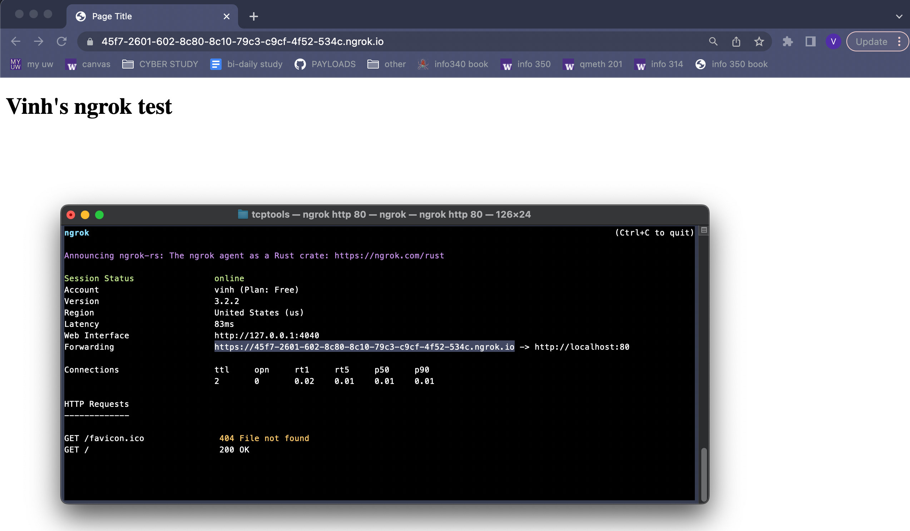
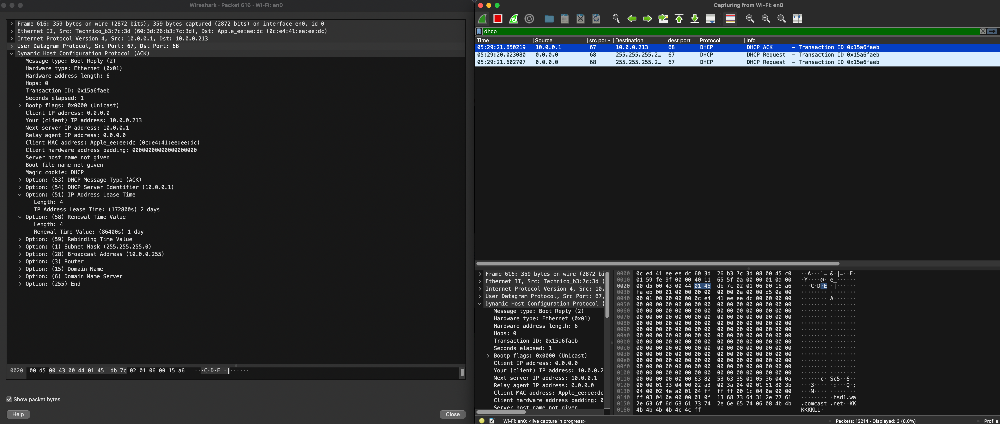
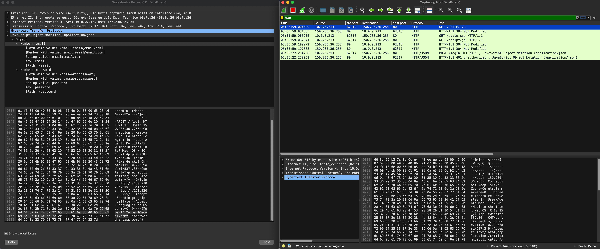

# TCP/IP Tools

## Ping:

### What were the min/avg/max/stddev statistics for each?
### Amazon
1. round-trip min/avg/max/stddev = 4.253/9.806/12.605/3.046 ms
2. round-trip min/avg/max/stddev = 4.430/7.871/11.377/2.953 ms
3. round-trip min/avg/max/stddev = 4.298/8.604/15.903/5.069 ms

### Google
1. round-trip min/avg/max/stddev = 3.228/30.064/75.979/26.445 ms
2. round-trip min/avg/max/stddev = 4.555/11.072/35.616/12.274 ms
3. round-trip min/avg/max/stddev = 4.369/40.689/98.047/34.484 ms
### Microsoft
1. round-trip min/avg/max/stddev = 4.545/18.559/33.456/10.109 ms
2. round-trip min/avg/max/stddev = 3.405/8.933/19.009/5.517 ms
3. round-trip min/avg/max/stddev = 9.260/19.696/34.232/8.276 ms

### Was there any packet loss on any of the pings?
None of the pings for any of the 3 websites had packet loss.

### Did the IP address change for a given website between pings?
For Amazon and Microsoft, every time I pinged, the IP would be different. For Google, everytime I pinged, the IP was the same.

## Tracert:

### What was the target server's IP address?
Amazon: 18.65.233.187
Google: 142.251.215.228
Microsoft: 23.216.81.152

### How many hops were needed to reach the target?
Amazon: 10
Google: 19
Microsoft: 15

### Can you identify your ISP from the intermediate server DNS names?
Many of the server DNS names have Comcast in them. This is my ISP.

### Identify the "class" of IP address for each major step in the trip
Amazon: A, A, A, A, A, A, A, A, B, A
Google: A, A, A, A, A, A, A, B, B, B, C, A, A, A, A, B, C, B, B
Microsoft: A, A, A, A, A, A, A, A, A, A, A, A, A, A, A

## Ngrok:

## Using packet-capture tools:

## Insecure web server 

